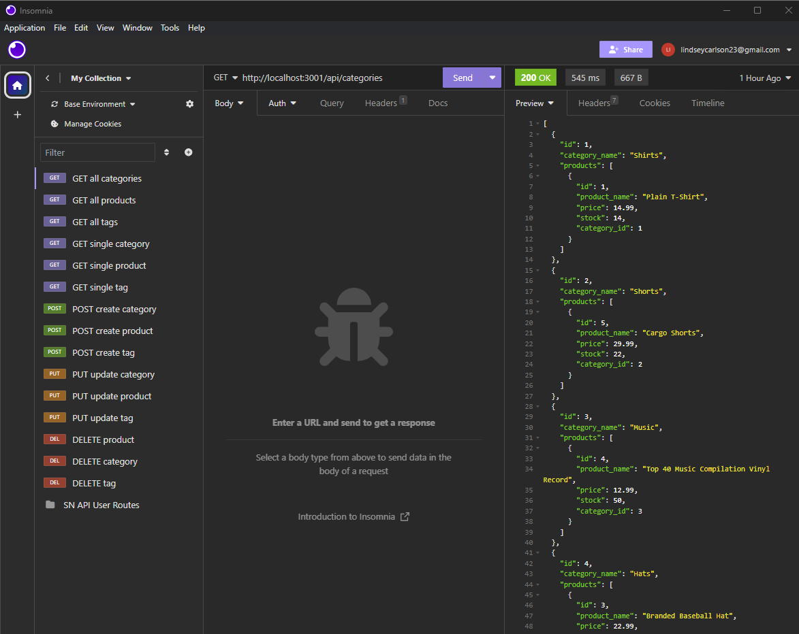

  # E-Commerce Backend 
  
  ## Description
  
  This project is an E-Commerce API that enables a business owner to view, create, and modify category, product, and tag data using the command line. I used inquirer for the prompts and mysql for the database. The starter code was provided, and I wrote all the CRUD routes.
  
  ## Table of Contents
  
  * [Installation](#installation)
  * [Usage](#usage)
  * [License](#license)
  * [Contribution Guidelines](#contributions)
  * [Questions](#questions)
  
  ## Installation
  
  This application requires node, inquirer, mysql, and a program such as vscode.
  
  ## Usage
  
  1. Open the integrated terminal.
  2. Enter `node seeds/index.js` to seed the database.
  3. Press enter. 
  4. Enter `node server.js` to start the server.
  5. View seeded database in MySQL Workbench.
  6. Imitate routes in Insomnia.

  

  Video demo: https://watch.screencastify.com/v/r3z61yzCe8MCc50hIA6l
  
  ## License
    
  This project uses the MIT license
    
  
  ## Contributions
  
  Starter code provided by the UT Austin Fullstack Bootcamp.
  
  ## Questions
  This project was created by [lindseycarlson23](https://github.com/lindseycarlson23)
  Send me an email here: lindseycarlson23@gmail.com
  